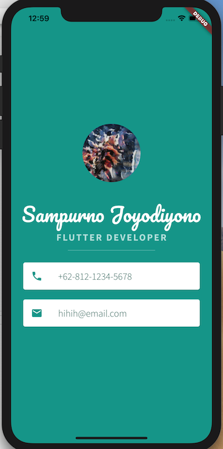

# Mi Card

A static professional card built with Flutter

## Demo

 

## Flutter Features

Below are the features used in this project:

* How to create Stateless Widgets
* How to use Containers to lay out your UI
* How to use Columns and Rows to position your UI elements
* How to add custom fonts
* How to add Material icons
* How to style Text widgets
* How to read and use Flutter Documentation

>This is based project to The App Brewery's Complete Flutter Development Bootcamp, check out the full course at [www.appbrewery.co](https://www.appbrewery.co/)
